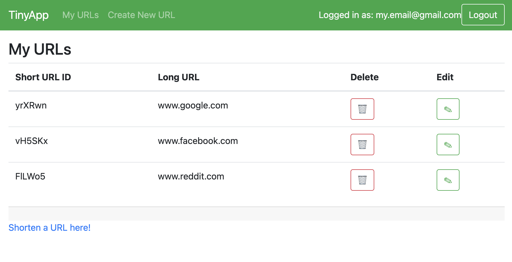
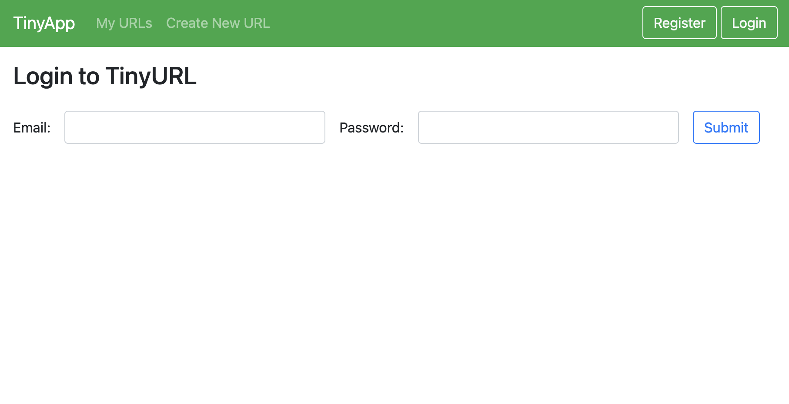

TinyApp is a full stack web application built with Node and Express that allows users to shorten long URLs (à la bit.ly).

## Final Product

## Dependencies

- Node.js
- Express
- EJS
- bcryptjs
- cookie-session

## Getting Started

- Install all dependencies (using the `npm install` command).
- Run the development web server using the `node express_server.js` command.
- Register for an account at the '/register' endpoint. This will automatically log you in.

## Creating a Tiny URL

- Navigate to the "Create New URL" tab in the navbar
- Enter the long URL you want to shorten
- You will be redirected to a page showing an index of all your URLs

## Modifying a Tiny URL

- Tiny URLs can be modified through the "My URLs" tab
- To delete a URL, simply click its wastebasket button
- To modify a URL, click the edit button. You will be taken to a page where you can change the Tiny URL's associated long URL

## Using a Tiny URL
- clicking on a short URL link in TinyApp will redirect the client to the short URL's respective long url. 

